# FinTech App: Continuous Integration (CI) Pipeline

This repository contains the Declarative Pipeline definition (`Jenkinsfile`) that automates the Continuous Integration lifecycle for our FinTech application.

## 🏗️ Architecture & Workflow

This pipeline removes the "Manual Tax" from the build process. It is triggered automatically and bridges the gap between source code and a deployable artifact.

**The CI Flow:**

`Developer Push` ➔ `GitHub Webhook` ➔ `Jenkins` ➔ `Test` ➔ `Docker Build` ➔ `Docker Hub`

```mermaid
graph TD
    %% Define Nodes
    Dev([👨‍💻 Developer Push])
    Git(GitHub Repository)
    Jenkins{Jenkins CI Server}
    
    %% Define Stages
    S1[Stage 1: Clone Code]
    S2[Stage 2: Run Tests]
    S3[Stage 3: Build Docker Image]
    S4[Stage 4: Push to Hub]
    
    %% Define Output
    Hub[(Docker Hub Registry)]

    %% Map the Flow
    Dev -->|git push origin main| Git
    Git -->|Webhook Payload| Jenkins
    Jenkins --> S1
    S1 --> S2
    S2 --> S3
    S3 --> S4
    S4 -->|Secure Auth & Push| Hub
    
    %% Add Styling
    style Jenkins fill:#D32F2F,stroke:#fff,stroke-width:2px,color:#fff
    style Hub fill:#0288D1,stroke:#fff,stroke-width:2px,color:#fff
```

## ⚙️ Infrastructure Prerequisites

For this pipeline to execute successfully, the host Jenkins server must have the following configured:

1. **Docker Engine:** Installed and actively running as a daemon.
2. **Permissions:** The `jenkins` Linux user must be a member of the `docker` group to execute builds without sudo privileges (`sudo usermod -aG docker jenkins`).
3. **Vault Management:** Docker Hub authentication tokens must be securely stored in the Jenkins Credentials Manager under the ID `docker-hub-credentials`.

## 🔄 Pipeline Stages Explained

* **Stage 1: Cloning Code** - Instead of building from the pipeline repository, Jenkins dynamically fetches the actual application source code from the `fintech-app-docker` repository.
* **Stage 2: Running Tests** - Executes the automated test suite to validate code integrity before packaging.
* **Stage 3: Build Docker Image** - Compiles the application into a container image using the `Dockerfile` located in the `./backend` directory.
* **Stage 4: Push to Docker Hub** - Securely authenticates with the container registry and pushes the built image.

**Versioning Strategy:** Every successful build pushes two tags to Docker Hub (e.g., `voncleph/fintech-app`):

* `latest`: A rolling tag for the most recent successful build.
* `v${BUILD_NUMBER}`: An immutable tag matching the Jenkins build execution number (e.g., `v12`, `v13`) to ensure perfect rollback capabilities and history tracking.